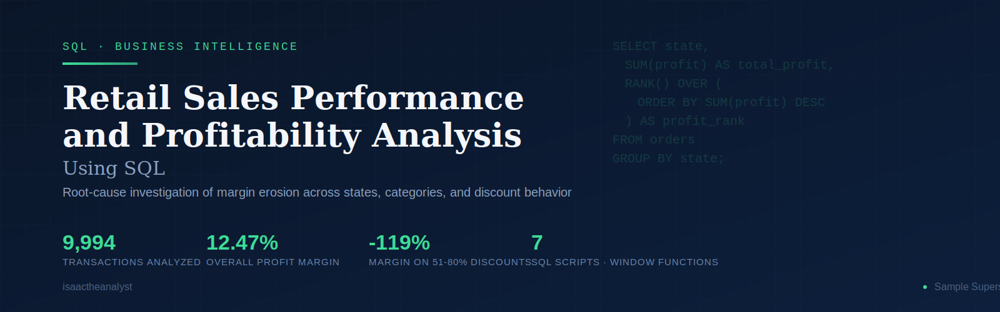
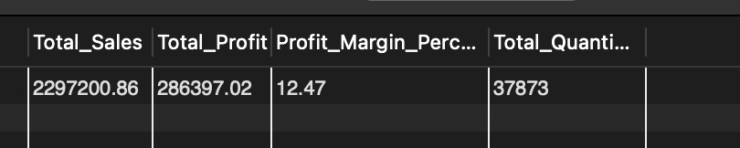
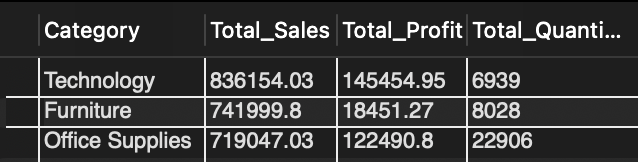
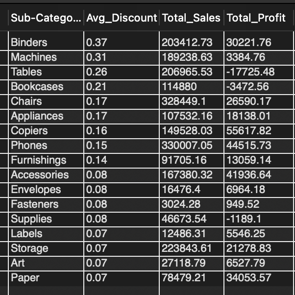
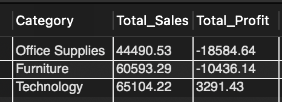

# 📊 Retail Sales Performance and Profitability Analysis Using SQL



**Tools:** SQL · Aggregate Functions · Window Functions · Subqueries
**Dataset:** Sample Superstore — 9,994 transactions across product categories, customer segments, and U.S. regions

Business-focused SQL analysis of retail sales and profitability, leveraging aggregation, ranking, subqueries, and window functions to identify revenue drivers, margin erosion, discount impacts, and geographic performance trends, culminating in a root-cause investigation of a $25K loss-making market.

---

## Project Overview

This project analyzes retail sales performance using SQL to evaluate revenue, profitability, regional performance, customer segments, product categories, and discount behavior.

The objective was to move beyond surface-level revenue reporting and uncover the underlying drivers of profitability. Through a combination of aggregation, ranking, and window function techniques, the analysis identifies where profit is generated, where it is lost, and what business actions could improve performance.

---

## Business Problem

The company generated **$2.30M in sales** and **$286K in profit**, resulting in an overall **12.47% profit margin**.

While the business appears healthy at a high level, profitability varies significantly across product categories, customer segments, states, and discount levels. This analysis was conducted to identify the key drivers of profitability and uncover the root causes behind underperforming markets and product lines.

---

## Dataset Overview

| Attribute | Detail |
|------------|------------|
| Transactions | 9,994 Orders |
| Geography | U.S. States & Regions |
| Product Scope | Categories & Sub-Categories |
| Customer Scope | Consumer, Corporate, Home Office |
| Key Metrics | Sales, Profit, Quantity, Discount |
| Source | Sample Superstore Dataset |

---

## Analytical Techniques & SQL Skills

- **Data Exploration** – dataset validation and structure review
- **Aggregation Analysis** – `SUM()`, `AVG()`, `COUNT()` with `GROUP BY`
- **Profit Margin Calculations** – category and state-level profitability analysis
- **Window Functions** – `RANK()`, `DENSE_RANK()`, and running totals using `SUM() OVER()`
- **Percentage Contribution Analysis** – cumulative revenue share calculations
- **Subqueries** – comparative and contribution-based analysis
- **Business Performance Analysis** – identifying revenue drivers and profit leakages

---

## Business Questions Answered

1. What is the company's overall sales and profit performance?
2. Which product categories generate the highest revenue and profit?
3. Which customer segments contribute the most value?
4. Which states and regions drive profitability and which generate losses?
5. How do discounts affect profitability?
6. Which product sub-categories perform best and worst?
7. Where is revenue most concentrated geographically?
8. What are the primary drivers of loss within the business?
9. Why is Texas generating losses despite strong sales performance?

---

## Key Findings

| Finding | Detail |
|----------|----------|
| Overall Profit Margin | 12.47% across $2.30M in sales |
| Technology Margin | 17.40% — highest-performing category |
| Furniture Margin | 2.49% despite generating over $742K in sales |
| Segment Efficiency | Home Office leads on margin (14.03%) despite being the smallest segment by revenue |
| Texas Performance | -$25.7K profit on $170K revenue; avg. 37% discount — a demand success and a pricing failure |
| Loss State Pattern | 10 states are loss-making; Ohio, Pennsylvania, and Illinois alone destroy $45K+ — Colorado and Tennessee run deeply negative margins even on small revenue |
| Discount Cliff | Margin turns negative above 20%; the 51–80% band operates at -119.20% margin, destroying $76.6K |
| Revenue Concentration | Top 5 states account for 52% of total revenue |
| Binders Exception | 37% avg discount, still $30.2K profit — pricing power matters more than discount level alone |
| Machines Risk | 31% avg discount, $3.4K profit on $189K sales — one pricing decision from a loss |
| Top Profit Sub-Category | Copiers at $55.6K profit — highest in the dataset without the highest sales |
| Largest Loss Driver | Tables at -$17.7K — primary drag on Furniture's 2.49% margin |

---

## Results Preview

### Overall Business Performance


### Category Performance


### Sub-Category Discount Analysis


### Texas Category Breakdown


---

## Business Impact

This analysis revealed that profitability challenges are driven less by revenue generation and more by discounting practices and product mix decisions. Critically, the Binders finding shows that heavy discounting does not universally destroy value — it destroys value when applied to products that cannot sustain it. This shifts the recommendation from a simple discount cap to a product-aware pricing governance framework.

Key opportunities identified include:
- Implementing product-aware discount governance — caps matter most for low-margin products like Tables and Machines, not uniformly across all lines
- Separating Furniture's discount problem (Tables, Bookcases) from Supplies' cost structure problem — they require different fixes
- Prioritizing Texas, Ohio, and Pennsylvania for targeted discount review — fastest path to measurable profit recovery
- Expanding focus on high-margin, low-discount product lines such as Copiers, Accessories, and Paper
- Investigating the Home Office segment's margin efficiency as a model for improving Consumer segment performance
- Replicating California and New York pricing practices in underperforming markets

> *"Profit isn't lost at the revenue line. It's lost at the discount approval."*

---

## Repository Structure

```text
retail-sales-profitability-analysis-sql/
│
├── README.md
│
├── SQL Scripts/
│   ├── 01_Data_Exploration.sql
│   ├── 02_Business_Performance.sql
│   ├── 03_Category_Analysis.sql
│   ├── 04_Regional_Analysis.sql
│   ├── 05_Segment_Analysis.sql
│   ├── 06_Discount_Analysis.sql
│   └── 07_Window_Functions.sql
│
├── Assets/
│   ├── cover.svg
│   └── screenshots/
│       ├── overall-business-performance/
│       ├── category-performance/
│       ├── segment-analysis/
│       ├── regional-analysis/
│       ├── subcategory-analysis/
│       ├── discount-impact-analysis/
│       ├── deep-dive-texas/
│       ├── revenue-concentration-analysis/
│       └── dense-rank/
│
├── Analysis Report/
│   ├── SQL-Sales-Performance-Report.md
│ 
│
└── Dataset/
    └── SampleSuperstore.csv
```

---

## Project Assets

Screenshots of SQL query outputs and analysis results are organised by section in the **Assets/screenshots** folder.

---

## Detailed Analysis Report

For complete methodology, SQL query breakdowns, business insights, the Texas profitability investigation, and strategic recommendations:

📖 **[View Full Analysis Report](Analysis-Report/SQL-Sales-Performance-Report.md)**

📄 [Download Full PDF Report](https://drive.google.com/file/d/19ss5OMJyl3bo6WUE_HPCR4avLFnphg9k/view?usp=sharing)

---

## Author

**Isaac Olatunji**
Business Intelligence Analyst focused on transforming data into actionable business insights through SQL, Power BI, Excel, and data storytelling.

GitHub: **isaactheanalyst**
