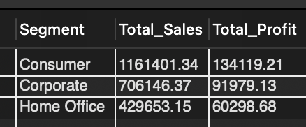
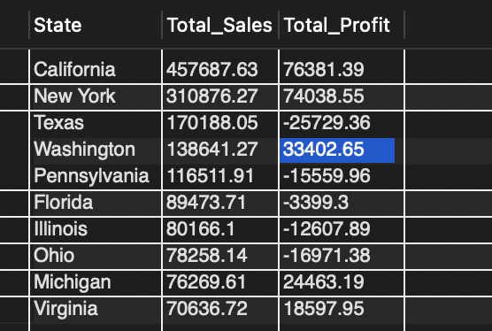
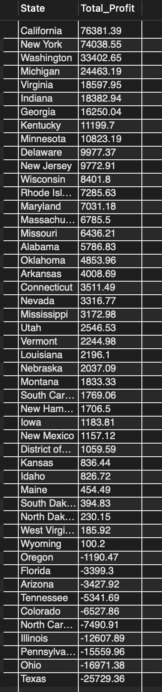
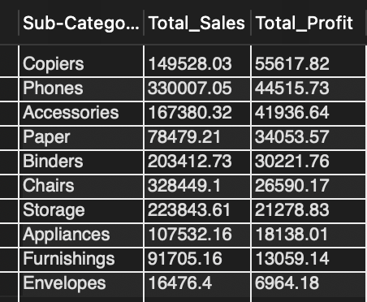
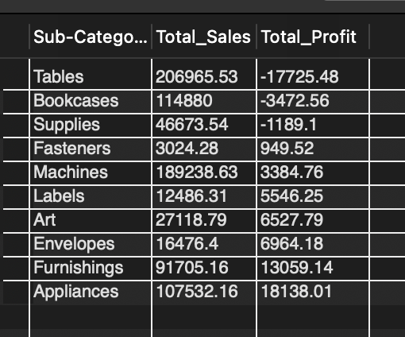
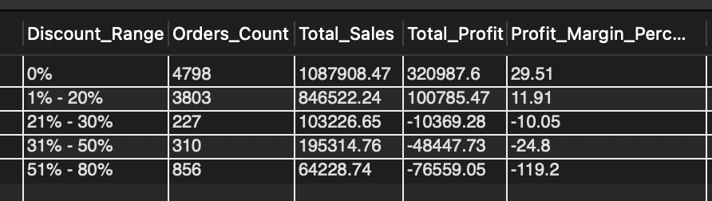
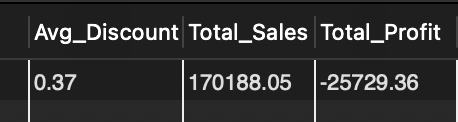
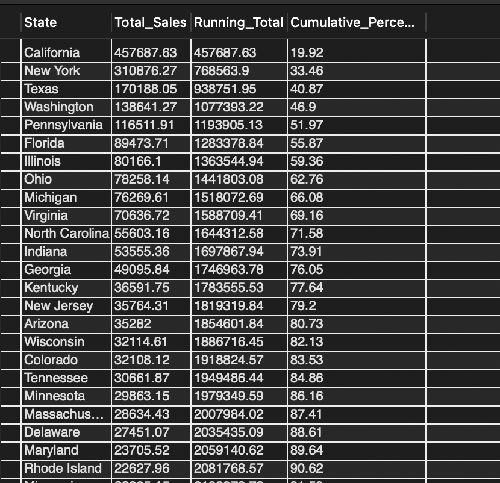
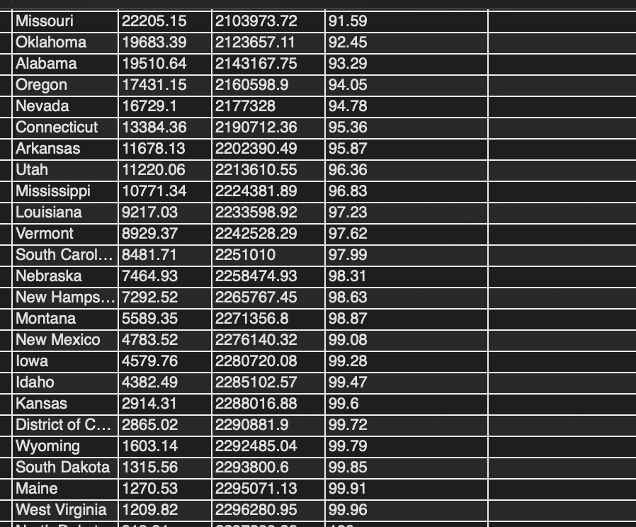
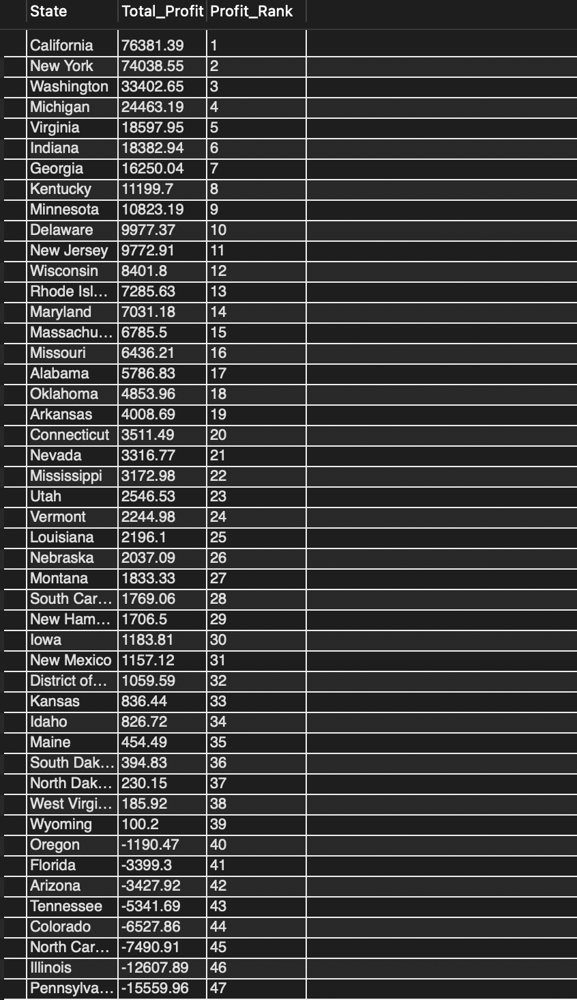

# Retail Sales Performance and Profitability Analysis Using SQL

**Analyst:** Isaac | isaactheanalyst

**Tools:** SQL · Aggregate Functions · Window Functions · Subqueries

**Dataset:** Sample Superstore — 9,994 transactions

---

## Executive Summary

This analysis evaluates retail sales performance across product categories, customer segments, U.S. regions, and discount behavior.

The business generates **$2.30M in revenue** but only **$286K in profit**, resulting in a **12.47% overall profit margin**. While top-line performance appears strong, profitability is highly uneven across states, categories, and discount levels.

**Core finding:** Profitability is concentrated in a small number of states and product lines, while excessive discounting — particularly in Texas — actively destroys margin. Improving pricing discipline and focusing on high-margin products represents the clearest path to profit improvement.

---

## Business Questions

This analysis was structured around the following questions:

1. What is the overall sales and profit performance of the business?
2. Which product categories generate the highest revenue and profit?
3. Which customer segments contribute the most value?
4. Which states and regions drive profitability or losses?
5. How do discounts affect profit performance?
6. Which sub-categories perform best and worst?
7. Where is revenue most concentrated geographically?
8. What are the primary drivers of loss?
9. Why is Texas generating losses despite strong sales performance?

---

## Methodology

The analysis followed a structured SQL workflow:

- **Data Exploration** — dataset validation, structure review, null checks
- **Aggregation Analysis** — `SUM`, `AVG`, `COUNT` with `GROUP BY`
- **Profitability Analysis** — profit margin calculations using `(SUM(profit) / SUM(sales)) * 100`
- **Ranking Analysis** — `RANK()` and `DENSE_RANK()` window functions to identify top and bottom performers
- **Running Totals** — cumulative performance tracking using `SUM() OVER (ORDER BY ...)`
- **Contribution Analysis** — percentage share of total revenue using subquery totals

---

## 1. Overall Business Performance


| Metric | Value |
| --- | ---: |
| Total Sales | $2,297,200 |
| Total Profit | $286,397 |
| Total Quantity Sold | 37,873 |
| Profit Margin | 12.47% |

**Insight:** The business is profitable overall, but the margin is modest. The gap between revenue and profit signals that discounting behavior and product mix are eroding returns beneath the surface.

---

## 2. Category Performance


| Category | Avg Discount | Sales | Profit | Margin |
| --- | ---: | ---: | ---: | ---: |
| Technology | 13% | $836,154 | $145,455 | 17.40% |
| Office Supplies | 16% | $719,047 | $122,491 | 17.04% |
| Furniture | 17% | $742,000 | $18,451 | 2.49% |

**Insight:** Furniture is the second-highest revenue category but generates less than 3% profit margin — contributing ~32% of sales while returning only ~6% of total profit. The average discount column reveals a direct pattern: Technology's lower discounting (13%) correlates with its stronger margin, while Furniture's higher discounting (17%) is a contributing factor to its margin collapse. This is not purely a cost problem — it is also a pricing discipline problem.

---

## 3. Customer Segment Analysis



| Segment | Sales | Profit | Margin |
| --- | ---: | ---: | ---: |
| Consumer | $1,161,401 | $134,119 | 11.55% |
| Corporate | $706,146 | $91,979 | 13.03% |
| Home Office | $429,653 | $60,299 | 14.03% |

**Insight:** Consumer is the largest segment by both revenue and profit volume, but it carries the lowest margin of the three at 11.55%. Home Office — the smallest segment — is actually the most margin-efficient at 14.03%. Corporate sits in the middle on both dimensions. This pattern shows that volume and margin efficiency do not move together across segments; a revenue-only view of segment performance would misrepresent where value is actually being created.

---

## 4. Regional & State Analysis





### Top Profit-Generating States

| State | Sales | Profit |
| --- | ---: | ---: |
| California | $457,688 | $76,381 |
| New York | $310,876 | $74,039 |
| Washington | $138,641 | $33,403 |
| Michigan | $76,270 | $24,463 |
| Virginia | $70,637 | $18,598 |

### Loss-Making States

| State | Sales | Profit |
| --- | ---: | ---: |
| Texas | $170,188 | -$25,729 |
| Ohio | $78,258 | -$16,971 |
| Pennsylvania | $116,512 | -$15,560 |
| Illinois | $80,166 | -$12,608 |
| North Carolina | $55,603 | -$7,491 |
| Colorado | — | -$6,528 |
| Tennessee | — | -$5,342 |
| Arizona | — | -$3,428 |
| Florida | $89,474 | -$3,399 |
| Oregon | — | -$1,190 |

**Insight:** Texas is the most critical issue — it is a top-3 revenue state generating the deepest losses in the dataset. The Sales column makes the problem sharper across all loss states: Ohio ($78K revenue, -$17K profit), Pennsylvania ($116K revenue, -$15.6K loss), and Illinois ($80K revenue, -$12.6K loss) all follow the same profile — meaningful revenue, net-negative returns. These are not small or marginal markets. They are mid-to-large revenue states where pricing execution is failing. The loss pattern across these four states alone accounts for over $70K in destroyed profit.

---

## 5. Sub-Category Performance






### Complete Sub-Category View — Sorted by Avg Discount

| Sub-Category | Avg Discount | Sales | Profit |
| --- | ---: | ---: | ---: |
| Binders | 37% | $203,413 | $30,222 |
| Machines | 31% | $189,239 | $3,385 |
| Tables | 26% | $206,966 | -$17,725 |
| Bookcases | 21% | $114,880 | -$3,473 |
| Chairs | 17% | $328,449 | $26,590 |
| Appliances | 17% | $107,532 | $18,138 |
| Copiers | 16% | $149,528 | $55,618 |
| Phones | 15% | $330,007 | $44,516 |
| Furnishings | 14% | $91,705 | $13,059 |
| Accessories | 8% | $167,380 | $41,937 |
| Envelopes | 8% | $16,476 | $6,964 |
| Fasteners | 8% | $3,024 | $950 |
| Supplies | 8% | $46,674 | -$1,189 |
| Labels | 7% | $12,486 | $5,546 |
| Storage | 7% | $223,844 | $21,279 |
| Art | 7% | $27,119 | $6,528 |
| Paper | 7% | $78,479 | $34,054 |

**Insight:** Sorting by average discount reveals the discount-profit relationship at the sub-category level with clarity. The pattern is consistent with the overall discount analysis — sub-categories discounted above 21% are where losses concentrate. Tables (26%, -$17.7K) and Bookcases (21%, -$3.5K) both sit above the profitability cliff and are loss-making. Machines (31%, $3.4K profit) sits firmly in the danger zone — technically profitable but operating at under 2% margin on $189K in sales, placing it one pricing decision away from joining the loss column.

The lower end of the table tells the opposite story. Accessories (8%, $41.9K), Paper (7%, $34K), and Storage (7%, $21.3K) all operate with disciplined discounting and return strong profits. Copiers (16%, $55.6K) is the highest-profit sub-category in the dataset and demonstrates that even moderate discounting is sustainable when the underlying pricing is sound.

**The Binders exception:** Binders carries the highest average discount in the entire dataset at 37% — well above the 21% profitability cliff — yet still generates $30.2K in profit. This is the strongest counter-example in the analysis. Unlike Tables and Bookcases, Binders appears to have sufficient pricing power and demand volume to absorb heavy discounting without turning loss-making. This suggests the discount threshold is not a universal ceiling: it is a warning zone where weak-margin products fail while strong-demand products can survive. The implication for discount governance is nuanced — blanket caps matter less than understanding which products can sustain discounting and which cannot.

**The Supplies exception:** Supplies loses $1.2K at only 8% average discount. Unlike every other loss-making sub-category, this is not a discount problem — the discounting is among the most disciplined in the dataset. The loss points to a cost structure or base pricing issue that requires a separate investigation, distinct from the discount governance recommendations that apply elsewhere.

---

## 6. Discount Analysis



```sql
SELECT
    CASE
        WHEN discount = 0 THEN '0%'
        WHEN discount BETWEEN 0.01 AND 0.20 THEN '1% - 20%'
        WHEN discount BETWEEN 0.21 AND 0.30 THEN '21% - 30%'
        WHEN discount BETWEEN 0.31 AND 0.50 THEN '31% - 50%'
        ELSE '51% - 80%'
    END AS discount_range,
    COUNT(*) AS orders_count,
    SUM(sales) AS total_sales,
    SUM(profit) AS total_profit,
    ROUND(SUM(profit) / SUM(sales) * 100, 2) AS profit_margin_pct
FROM orders
GROUP BY discount_range
ORDER BY MIN(discount);
```

| Discount Range | Orders | Total Sales | Total Profit | Profit Margin |
| --- | ---: | ---: | ---: | ---: |
| 0% | 4,798 | $1,087,908 | $320,988 | 29.51% |
| 1% – 20% | 3,803 | $846,522 | $100,785 | 11.91% |
| 21% – 30% | 227 | $103,227 | -$10,369 | -10.05% |
| 31% – 50% | 310 | $195,315 | -$48,448 | -24.80% |
| 51% – 80% | 856 | $64,229 | -$76,559 | -119.20% |

**Insight:** The relationship between discount level and profitability is not gradual — it is a cliff. Full-price orders (0% discount) carry a strong 29.51% margin, and even modest discounting up to 20% remains profitable at 11.91%. But the moment discounts cross 21%, every single band turns net-negative. The damage compounds severely from there: the 51–80% discount band — 856 orders, a meaningful volume — operates at a **-119.20% margin**, meaning the business loses more than the full sale value on each of these transactions. This single band alone destroys $76.6K in profit.

The Binders finding from Section 5 adds important nuance here: a 37% avg discount at the sub-category level can still produce $30K in profit, which means the -24.80% margin in the 31–50% band is driven primarily by weaker products in that range — Tables and Machines — rather than being a universal outcome. The discount analysis sets the boundary; the sub-category analysis identifies which products are dragging the band into loss territory.

---

## 7. Texas Deep Dive

Texas is the clearest example of discount-driven loss in the dataset.




| Metric | Value |
| --- | ---: |
| Total Sales | $170,188 |
| Total Profit | -$25,729 |
| Avg Discount | 37% |

### Category Breakdown — Texas

| Category | Sales | Profit |
| --- | ---: | ---: |
| Office Supplies | $44,491 | -$18,585 |
| Furniture | $60,593 | -$10,436 |
| Technology | $65,104 | $3,291 |

**Insight:** Texas loses money on two of its three categories. Office Supplies — which operates at a 17% margin nationally — generates -$18.6K in Texas on just $44K in sales, implying the category is being discounted into deep loss territory. Furniture follows the same pattern at -$10.4K on $60K in sales. Technology is the only bright spot at $3.3K profit, likely because it carries less aggressive discounting than the other two categories.

The 37% average discount across all Texas transactions places most orders firmly inside the 31–50% discount band, which the discount analysis shows operates at a -24.80% margin company-wide. Connecting this to the Binders finding: Binders absorbs 37% discounts nationally and remains profitable — but Texas applies that same average discount level across categories that cannot sustain it. The problem is not that 37% discounts always destroy value; it is that Texas applies heavy discounting indiscriminately across products that do not have the pricing power to survive it. Texas is a demand success and a pricing failure.

---

## 8. Window Function Analysis

Window functions were used throughout the analysis to provide ranked and cumulative views of performance.

### Revenue Concentration Analysis





```sql
SELECT
    state,
    SUM(sales) AS total_sales,
    SUM(SUM(sales)) OVER (ORDER BY SUM(sales) DESC) AS running_total,
    ROUND(
        SUM(SUM(sales)) OVER (ORDER BY SUM(sales) DESC) / SUM(SUM(sales)) OVER () * 100, 2
    ) AS cumulative_pct
FROM orders
GROUP BY state
ORDER BY total_sales DESC;
```

| State | Total Sales | Running Total | Cumulative % |
| --- | ---: | ---: | ---: |
| California | $457,688 | $457,688 | 19.92% |
| New York | $310,876 | $768,564 | 33.46% |
| Texas | $170,188 | $938,752 | 40.87% |
| Washington | $138,641 | $1,077,393 | 46.90% |
| Pennsylvania | $116,512 | $1,193,905 | 51.97% |

**Insight:** The top 5 states account for just over 52% of total company sales. California alone represents nearly 20% of all revenue. This concentration means that performance — or underperformance — in a small number of markets has outsized consequences. It is why Texas's losses matter as much as they do: it sits inside the revenue-critical top 5, and its -$25.7K loss is not a marginal market problem — it is a core revenue market failing on profitability.

---

### State Profit Ranking




```sql
SELECT
    state,
    SUM(profit) AS total_profit,
    DENSE_RANK() OVER (ORDER BY SUM(profit) DESC) AS profit_rank
FROM orders
GROUP BY state
ORDER BY profit_rank;
```

`DENSE_RANK()` was used here to rank all states by profitability without gaps in the ranking sequence, confirming the clear separation between high-performing states (California, New York) and loss-making states (Texas, Ohio, Pennsylvania) — and establishing Texas's position at the bottom despite its top-3 revenue rank.

---

### Running Total of Sales by Order Date

```sql
SELECT
    order_date,
    sales,
    SUM(sales) OVER (ORDER BY order_date) AS running_total_sales
FROM orders;
```

Used to track cumulative revenue progression over time and identify periods of accelerated growth.

---

## Key Findings

| # | Finding |
| --- | --- |
| 1 | Overall profit margin is 12.47% — functional, but masking significant variation beneath the surface |
| 2 | Furniture earns only 2.49% margin despite being the second-largest revenue category; its 17% avg. discount is the highest of any category |
| 3 | Tables (26% avg discount, -$17.7K) and Bookcases (21%, -$3.5K) are loss-making due to discounting; Machines (31%, $3.4K profit) is one pricing decision from joining them; Supplies loses money at just 8% discount — a cost problem, not a discount problem |
| 4 | Binders absorbs 37% avg discount and still returns $30.2K profit — the strongest evidence that pricing power, not discount level alone, determines profitability |
| 5 | The top 5 states account for 52% of total revenue — California alone contributes 19.92% |
| 6 | Texas generates $170K in revenue but loses $25.7K — a top-3 revenue market with a -15.1% profit margin, driven by 37% avg discount applied across products that cannot sustain it |
| 7 | Discounts above 20% turn profitability negative; the 51–80% band operates at -119.20% margin, destroying $76.6K in profit alone |
| 8 | Home Office is the most margin-efficient segment at 14.03% despite being the smallest by revenue |
| 9 | Copiers generate $55.6K profit at 16% avg discount — the highest profit of any sub-category, without having the highest sales |

---

## Recommendations

### 1. Strengthen Discount Governance — Product by Product
The Binders finding shows that blanket discount caps are insufficient. The real priority is identifying which products can sustain discounting (strong demand, healthy unit economics) and which cannot (Tables, Bookcases, Machines). Discounts above 20% on low-margin products should require explicit sign-off. Discounts above 50% — which produce a -119% margin — should be treated as near-automatic losses and eliminated except in specific clearance scenarios.

### 2. Address Furniture and Supplies Profitability Separately
Tables (26% avg discount) and Bookcases (21%) are losing money because of discounting — the fix is pricing discipline, not product restructuring. Supplies is a different problem: it loses $1.2K at only 8% average discount, meaning the issue is cost structure or base pricing, not discount behavior. These require separate investigations and should not be treated as the same problem.

### 3. Prioritize Texas, Ohio, and Pennsylvania for Discount Review
These three states collectively destroy over $57K in profit on combined revenue that should be performing. Texas at 37% avg discount is the most urgent. A targeted discount governance intervention in these markets — before applying broader policy changes — would deliver the fastest measurable impact on overall profitability.

### 4. Scale High-Margin, Low-Discount Product Lines
Accessories (8% avg discount, $41.9K profit), Copiers (16%, $55.6K), and Paper (7%, $34K) demonstrate that disciplined pricing produces the strongest returns. Inventory investment and sales focus in these lines would improve overall margin without requiring volume growth.

### 5. Investigate the Home Office Segment
Home Office is the smallest segment by revenue but the most margin-efficient at 14.03%. Understanding what drives that efficiency — order size, product mix, discount behavior — could provide a model for improving margin discipline across the Consumer segment, which carries the lowest margin at 11.55%.

### 6. Replicate California and New York Performance
Both states combine top-tier revenue with strong profitability. Analyzing their discount behavior, product mix, and segment distribution against loss-making states of similar revenue scale could provide a direct playbook for markets like Texas and Pennsylvania.

---

## Conclusion

The business is fundamentally profitable — but performance is uneven, and the data shows exactly where and why. Margin erosion is not random. It is concentrated in specific states, specific product categories, and specific discount behaviors that are identifiable and correctable.

Texas is the most visible example: a top-3 revenue state losing $25.7K on a 37% average discount applied indiscriminately across categories that cannot sustain it. Ohio, Pennsylvania, and Illinois follow the same revenue-without-profit profile — collectively destroying over $45K despite generating meaningful sales. The Furniture category — and Tables in particular — represent a structural drag that high revenue cannot offset.

The Binders finding adds an important layer: heavy discounting does not always destroy value. It destroys value when it is applied to products with insufficient pricing power. That distinction changes the nature of the recommendation — from a simple discount cap to a more precise, product-aware pricing governance framework.

The path forward is clear: product-aware pricing discipline, a split investigation into Furniture (discount problem) and Supplies (cost problem), and continued investment in the categories and markets where the business already demonstrates strong margin performance.

> *"Profit isn't lost at the revenue line. It's lost at the discount approval."*
